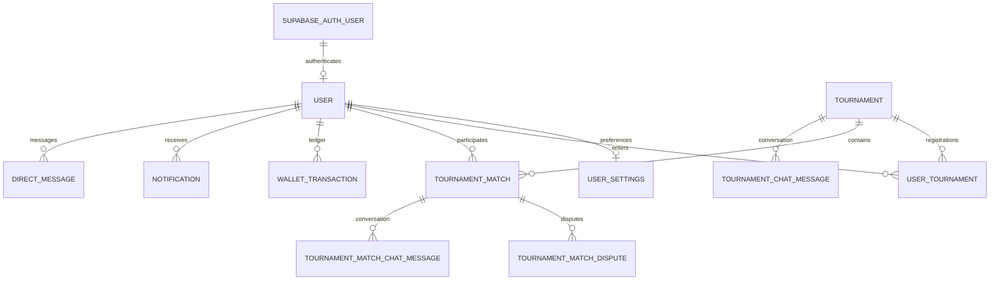

# GameArena first-release blueprint

Goal: a player can register, enter a tournament, play and report a match, and
receive the correct prize; an admin can manage the tournament and resolve disputes.
This proposed release boundary prioritizes reliability before adding features.

## Data map

The authoritative schema is `gamearena/models.py`, applied through the migrations.
Supabase Auth UUIDs map onto existing GameArena user IDs; wallets and match history
continue to reference GameArena IDs.

The diagram summarizes roles; `TournamentMatch` has separate player-one,
player-two and winner foreign keys. Inspect the models for precise cardinalities,
optional columns and constraints.

## Release acceptance checks

| Journey | Completion evidence | Current review status |
| --- | --- | --- |
| Register and verify | Confirmation required; repeated taps send one email; visible 60-second cooldown | Code changed; staging provider test required |
| Password and Google sign-in | Correct custom-domain callback; verified identity; suspension enforced; one active credential provider | Code changed; provider setup and staging test required |
| Recovery | Single-use provider code changes password; earlier app sessions rejected; no raw JSON for browser errors | Code changed; staging test required |
| Tournament entry | Capacity and duplicate-entry rules; entry fee charged once; retries do not double-charge | Existing implementation; release audit required |
| Matches and disputes | Both players see assigned match; result confirmation; admin resolves disputed results | Existing implementation; release audit required |
| Prizes and wallet | Correct currency units; ledger reconciles; verified payment webhooks; prize paid once | Existing implementation; release audit required |
| Notifications | Real per-user unread count; read actions update it; 99+ only above 99 | Existing implementation; badge formatting aligned |
| Errors and availability | Branded 403/404/500; helpful 429 with retry time; always-on auth callbacks | Error code present; production hosting/deploy check required |

Do not mark a row complete from implementation alone. Record the tested build,
environment, scenario and result. Release scope excludes further social features,
achievements and UI expansion until these core journeys pass.
